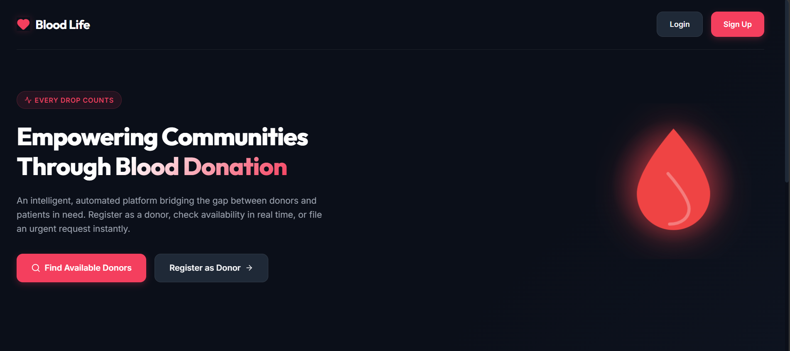
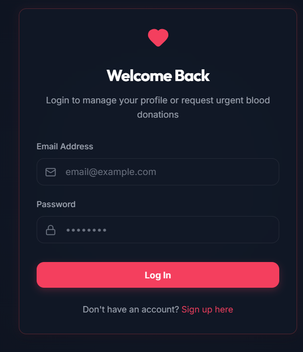
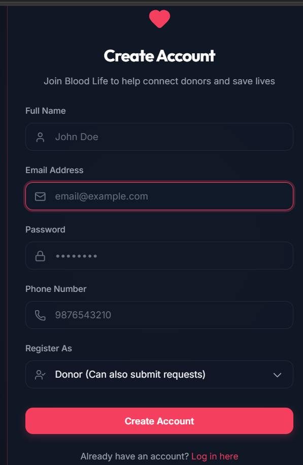
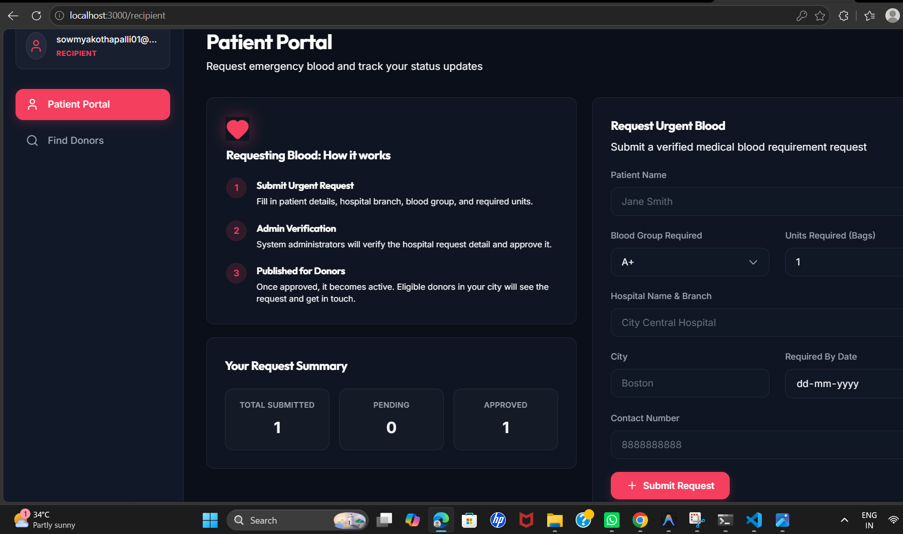
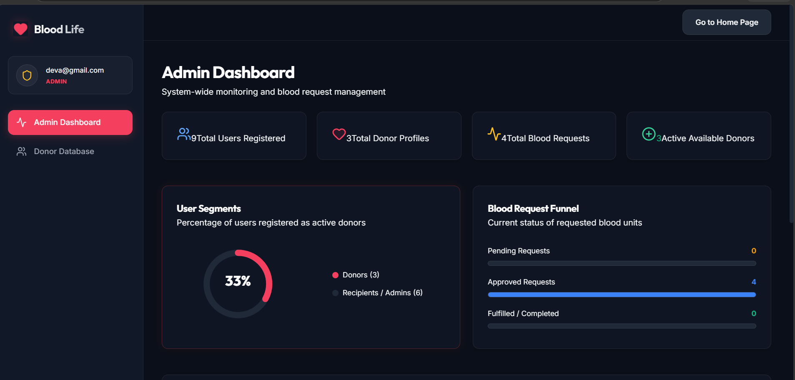

# 🩸 Blood Donation Management System

## 📌 Project Overview

The Blood Donation Management System is a full-stack web application developed using React, Spring Boot, and MySQL. This system helps connect blood donors and recipients efficiently by providing features such as donor registration, blood request management, and user dashboards.

The main objective of this project is to simplify the blood donation process and make blood availability information easily accessible during emergencies.

---

## 🚀 Features

### User Features
- User Registration
- User Login
- Donor Registration
- Blood Request Management
- Search Blood Donors
- Recipient Dashboard
- User Profile Management

### Admin Features
- Admin Dashboard
- Manage Donors
- Manage Blood Requests
- Monitor System Activities
- View Donation Records

---

## 🛠️ Tech Stack

### Frontend
- React.js
- Vite
- HTML
- CSS
- JavaScript

### Backend
- Spring Boot
- Spring Data JPA
- REST APIs
- Maven

### Database
- MySQL

### Tools
- Git
- GitHub
- Postman
- VS Code

---

## 📂 Project Structure

```text
Blood-Donation-Management-System-Application
│
├── frontend
├── backend
├── screenshots
└── README.md
```

## ⚙️ Installation & Setup

### Clone Repository

```bash
git clone https://github.com/kothapallisowmya/Blood-Donation-Management-System-Application.git
```

### Backend Setup

```bash
cd backend
mvn spring-boot:run
```

Backend runs on:

```text
http://localhost:8080
```

### Frontend Setup

```bash
cd frontend
npm install
npm run dev
```

Frontend runs on:

```text
http://localhost:5173
```

---

## 📸 Screenshots

### Home Page



### Login Page



### Signup Page



### Donor Portal


### Patient Portal



### Admin Dashboard



---

## 🎯 Future Enhancements

- JWT Authentication
- Email Notifications
- SMS Notifications
- Location-Based Donor Search
- Blood Donation History
- Mobile Application Support
- Advanced Analytics Dashboard

---

## 👨‍💻 Author

**Kothapalli Sowmya**

GitHub:
https://github.com/kothapallisowmya

---

## ⭐ Project Status

Completed and under continuous improvement.

If you found this project useful, please give it a ⭐ on GitHub.